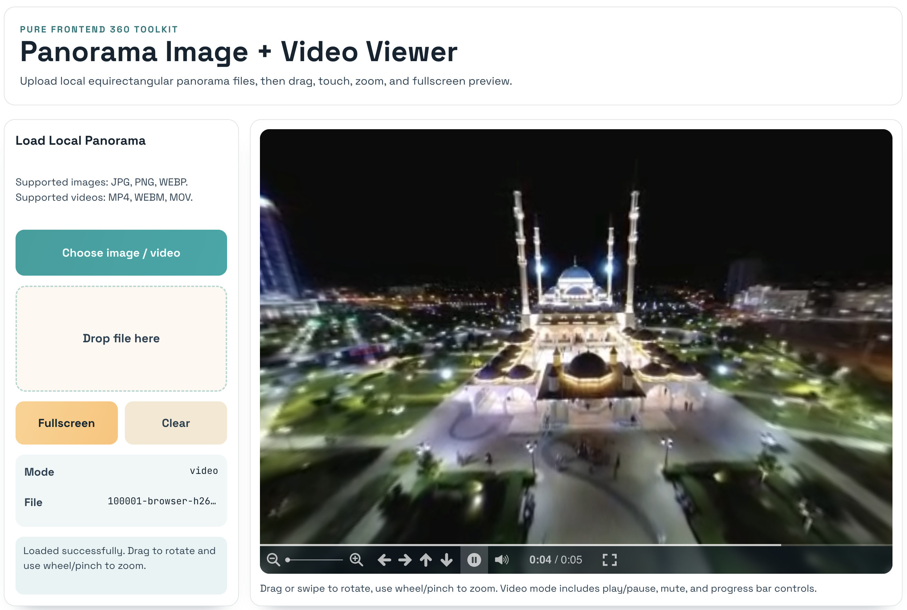

<h1 align="center">
	
	360 Panorama Viewer
</h1>

<p align="center">
	<a href="https://youjunzhao.github.io/PanoViewer/">
		
	</a>
</p>

## Demo





Pure frontend 360 panorama viewer based on Photo Sphere Viewer + TypeScript + Vite.

It supports loading local equirectangular panorama images and videos directly in browser using File API + URL.createObjectURL(), without any backend.

## Features

- Upload local equirectangular panorama image and video files
- Drag and touch to rotate viewpoint
- Mouse wheel / pinch zoom
- Fullscreen viewing
- Video mode controls: play/pause, mute, time/progress bar (via VideoPlugin)
- Drag-and-drop file loading
- Client-side 2:1 ratio validation: strict for images, warning-only for videos
- Automatic in-browser conversion for unsupported codecs (tries MP4 H.264 first, then WebM VP9)

## Tech Stack

- Vite
- TypeScript
- Photo Sphere Viewer
	- @photo-sphere-viewer/core
	- @photo-sphere-viewer/equirectangular-video-adapter
	- @photo-sphere-viewer/video-plugin
- Vitest + jsdom (unit tests)

## Development

Install dependencies:

```bash
npm install
```

Start development server:

```bash
npm run dev
```

Run tests:

```bash
npm run test
```

Build production bundle:

```bash
npm run build
```

Preview production bundle:

```bash
npm run preview
```

## Deployment

This app is configured as static frontend and can be deployed directly from the generated dist directory.

The Vite base is configured as relative path (`./`) in vite.config.ts, which works well for static hosts.

### GitHub Pages

1. Run `npm run build`
2. Deploy `dist/` to GitHub Pages (for example with gh-pages action or upload to `gh-pages` branch)
3. Ensure Pages serves static files from the deployed folder

### Vercel

Use these settings:

- Framework Preset: Vite
- Build Command: `npm run build`
- Output Directory: `dist`

### Cloudflare Pages

Use these settings:

- Build Command: `npm run build`
- Build output directory: `dist`
- Node version: 20+

## Notes

- Panorama sources are expected to be equirectangular and close to 2:1 ratio.
- Images that fail the ratio check are blocked. Videos that fail the ratio check show a warning but still attempt to load.
- If video rendering still fails, the browser likely cannot decode the codec/profile. Convert to MP4 (H.264/AVC + AAC, yuv420p, faststart) or WebM (VP9 + Opus).
- In-browser conversion runs locally in your browser and may download transcoder core assets on first use.
- Extremely large videos are better converted offline with ffmpeg to avoid browser memory pressure.
- Very large video panoramas may be limited by browser/GPU capabilities.
